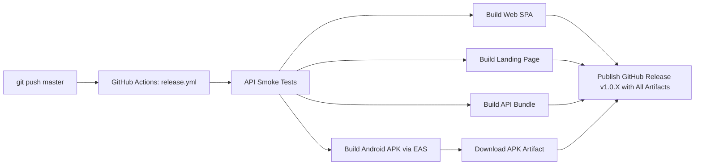

# React Native APK Build Plan & Architecture

## Goal
Build a sideloadable Android APK directly from the Expo project using **EAS Build** integrated into GitHub Actions CI, attached automatically to every GitHub Release on push to `master`.

---

## Architecture & Configuration

| Component | Setting / Value | Purpose |
|---|---|---|
| **Expo Account** | `fin45309` | Project owner on Expo cloud |
| **Project ID** | `0a7d858e-6991-44c3-88f9-d67a24d87edd` | Linked via `apps/mobile/app.json` |
| **EAS Config** | `apps/mobile/eas.json` | `preview` profile builds standalone `.apk` for distribution |
| **CI Integration** | `.github/workflows/release.yml` | `build-android` job runs on push to `master` with `EXPO_TOKEN` |
| **Artifact Output** | `app-debug.apk` | Uploaded to CI artifacts and attached to GitHub Releases |

---

## Build Pipeline Workflow



---

## EAS Profiles (`eas.json`)
- **`preview`**: Builds standalone Android APK for distribution / sideloading without going through Google Play Console.
- **`production`**: Configured for store release.
- **`development`**: For Expo Dev Client.

---

## Local Commands (Optional manual builds)
```bash
# Sideloadable APK via cloud:
cd apps/mobile
npx eas-cli build --platform android --profile preview

# Run local development:
npm start
```
